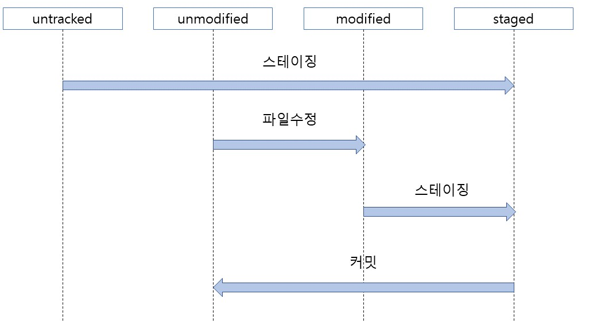

# git 명령어

## git 초기화

- `git init`  
  디렉터리 깃 저장소를 초기화 (.git 폴더 생성)

## git의 기본구조

- 작업 트리, 작업 디렉터리(working tree, working directory)  
  현재 작업중인 공간()

- 스테이지(stage)  
  버전으로 만들 파일이 대기하는 곳  
  .git/index 파일에 저장

- 저장소(repository)  
  스테이지에 대기하던 파일들을 버전으로 만들어 저장하는곳  
  .git/HEAD 파일에 저장

## git 상태

- `git status`  
  깃의 상태를 출력  
  `untracked 파일`: git이 한번도 관리해보지 않은 파일(변경사항 저장X)  
  `tracked 파일`: git에서 관리하고 있는 파일  
  
- `git log`  
  깃의 현재 버전 확인  
  `k`로 위로 스크롤  
  `j`로 아래로 스크롤  
  `:q`로 종료 가능  
  `커밋 해쉬`: 커밋을 구별하는 고유 해쉬값

- `git diff`  
  작업 트리에 있는 파일과 스테이지에 있는 파일을 비교하거나  
  스테이지에 있는 파일과 최신 커밋을 비교할수 있다.

## git 스테이징

- `git add 파일이름`  
  해당 파일을 스테이지에 올린다.

- `git add .`  
  작업 트리에서 변경된 모든 파일을 스테이지에 올린다.

## git 커밋

- `git commit -m "message1"`  
  현재 스테이지에 올라온 모든 파일을 커밋하고 커밋 메세지를 남긴다.

- `git commit`  
  현재 스테이지에 올라온 모든 파일 커밋하고 vim으로 커밋 메세지를 직접 적는다.

- `git commit -am "message2"`  
  한번 tracked한 파일들은 스테이징과 커밋을 동시에 할수 있다.

- `git commit --amend`  
  방금 커밋한 메세지 수정하기
