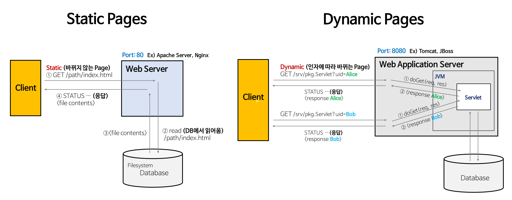

출처 : https://gmlwjd9405.github.io/2018/10/27/webserver-vs-was.html

## Static pages VS Dynamic Pages

- Static Pages

  - Web Server는 파일 경로 이름을 받아 경로와 일치하는 file contents를 반환한다.
  - 항상 동일한 페이지를 반환한다.
  - Ex) image, html, css, javascript 파일과 같이 컴퓨터에 저장되어 있는 파일들
  - 사실 언제나 똑같은 페이지는 아니다, 현재 날짜와 시간을 표현, 랜덤함수, 혹은 프론트에서 서버로 직접 요청할수도 있다(전부 자바스크립트의 기능)
  - 결국 정적 웹의 기준은 서버가 보내는 HTML,CSS,JS, 동영상, 이미지 파일들이 언제나 동일한가? 이다.
  - 즉 서버에서 매번 가공해서 보내주는게 아니고, 프로그래머가 짠 그대로 언제나 똑같이 받으면 정적 웹
  - 주로 변하지 않고 거의 고정적인 페이지에 많이 쓴다. ex) 회사소개, 음식메뉴, 댓글없는 블로그

- Dynamic Pages
  - 인자의 내용에 맞게 동적인 contents를 반환한다.
  - 즉, 웹 서버에 의해서 실행되는 프로그램을 통해서 만들어진 결과물 \* Servlet: WAS 위에서 돌아가는 Java Program
  - 개발자는 Servlet에 doGet()을 구현한다.
  - 예를들어 DB내용에 따라 페이지 내용이 바뀌어야할 경우, 서버에서 DB에서 데이터를 불러온 다음, 이 데이터를 가지고 페이지를 만들어서 유저에게 보내면, DB 상태에 따라 페이지에 다른 내용이 들어가게 만들어진다.
  - 같은 페이지라도 사용자마다 다른 결과의 웹 페이지를 서버에 요청하고 받게 된다.
  - 우리가 보는 대부분의 웹 페이지는 동적 웹페이지

## 무조건 정적웹 보다 동적 웹이 좋은가?

NO! 예를 들어 블로그를 글을 동적웹으로 만들었다고 생각해보자, 작성자, 제목, 내용, 작성일, 댓글 등의 정보가 DB에 따로 저장되고, 호출때마다 동적으로 반영되어 제공이 된다. 그런데 같은 글을 보여줄때마다 서버가 계산을 하는건 나중에가면 큰 손해다. 차라리 통채로 HTML 파일로 저장해놓는게 서버에게 유리, 즉 이런 경우 정적 블로그로 운영하는게 유리하다.  
github 블로그는 정적 웹이다.

## 장단점

- 정적 웹 페이지의 장점
  - 빠르다
  - 비용이 적다
- 정적 웹 페이지의 단점

  - 서비스가 한정적이다
  - 관리가 힘들다: 추가/수정/삭제 모두 개발자가 직접 파일 수정

- 동적 웹 페이지의 장점
  - 서비스가 다양하다: 다양한 정보를 조합하여 동적으로 생성해서 보여주는게 가능
  - 관리가 쉽다: 웹 사이트 구조에 따라서 추가/수정/삭제 등의 작업이 쉽다
- 동적 웹 페이지의 단점
  - 상대적으로 느리다: 사용자에게 웹 페이지를 전달전 처리하는 작업 필요
  - 추가 비용: 웹 서버외에 추가적으로 처리를 위한 WAS가 필요
