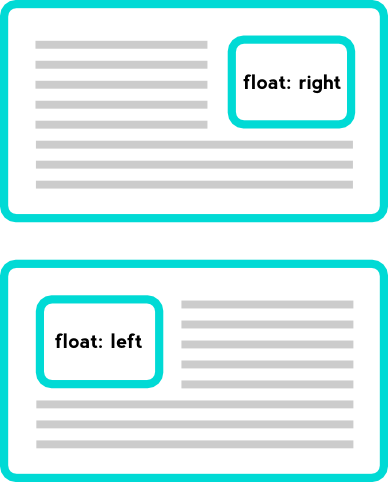

# Float

float 프로퍼티는 주로 레이아웃을 구성할 때 블록 레벨 요소를 가로 정렬하기 위해 사용되는 중요한 기법이다. flexbox 레이아웃를 사용한다면 더욱 간단하게 정렬을 구현할 수도 있지만 flexbox 레이아웃을 지원하지 않는 IE를 고려해야 한다면 float 프로퍼티를 사용해야 한다.

float 프로퍼티는 본래 이미지와 텍스트가 있을 때, 이미지 주위를 텍스트로 감싸기 위해 만들어진 것이다.



- left: 왼쪽부터 정렬
- right: 오른쪽부터 정렬
- none: 기본값(없음)

## 수평 정렬

정렬순서는 위에서 부터 아래로 내려오면서 적용된다.

1 : right  
2: left  
3: right  
4: left

이면  
2 4 3 1 순서이다

## width

원래 width 프로퍼티의 기본값은 100%이므로 width 프로퍼티값을 지정하지 않은 block 요소는 부모 요소의 가로폭을 가득 채운다.

그러나 width 프로퍼티를 선언하지 않은 block 레벨 요소에 float 프로퍼티가 선언되면 width가 inline 요소와 같이 content에 맞게 최소화되고 다음 요소 위에 떠 있게(부유하게) 된다.

```html
<!DOCTYPE html>
<html>
  <head>
    <style>
      .box {
        color: white;
        font-weight: bold;
        font-size: 30px;
        line-height: 50px;
        height: 50px;
        margin: 0 10px;
        padding: 10px;
      }
      .d1 {
        float: left;
        background: red;
      }
      .d2 {
        background: orange;
      }
    </style>
  </head>
  <body>
    <div class="box d1">float: left;</div>
    <div class="box d2">div</div>
  </body>
</html>
```

즉 두개의 div가 연속으로 있으면, 원래는 두줄이지만 => 하나에 float left를 적용하면  
두개의 div가 같은 줄에 위치하는데 첫번째 div가 왼쪽에 떠있게 된다.  
그러나 두번째 div가 길이가 줄어든게 아니고 100%를 차지하고, 첫번째 div가 그냥 위에 떠있어 가릴뿐이다  
가려져야할 두번쨰 div의 content는 float의 효과에 의해 자연스럽게 첫번째 div가 가리는 영역밖에 나와서 보이게 된다.(원래 float의 의도 답게)

## 문제1 float 프로퍼티가 선언된 요소와 float 프로퍼티가 선언되지 않은 요소간 margin이 사라지는 문제

div 두개의 예시에서 차례대로 정렬된 것처럼 보이지만 사실은 float 프로퍼티가 선언된 요소가 다음 요소 위에 떠 있는(부유하고 있는) 상태이다. 따라서 두 요소간의 margin은 제대로 표현되지 않는다.

이것은 두번째 요소에 float 프로퍼티를 선언하지 않았기 때문에 발생하는 박스 모델 상의 문제이다. 이 문제를 해결하는 가장 쉬운 방법은 float 프로퍼티를 선언하지 않은 요소에 `overflow: hidden `프로퍼티를 선언하는 것이다.

`overflow: hidden` 프로퍼티는 자식 요소가 부모 요소의 영역보다 클 경우 넘치는 부분을 안보이게 해주는 역할을 하는데 여기서는 float 프로퍼티가 없어서 제대로 표현되지 못하는 요소를 제대로 출력해준다. => one true layout 방식

```html
<!DOCTYPE html>
<html>
  <head>
    <style>
      .box {
        color: white;
        font-weight: bold;
        font-size: 30px;
        line-height: 50px;
        height: 50px;
        margin: 0 10px;
        padding: 10px;
      }
      .d1 {
        float: left;
        background: red;
      }
      .d2 {
        overflow: hidden;
        background: orange;
      }
    </style>
  </head>
  <body>
    <div class="box d1">float: left;</div>
    <div class="box d2">div</div>
  </body>
</html>
```

## 문제 2: float 프로퍼티가 선언된 자식 요소를 포함하는 부모 요소의 높이가 정상적으로 반영되지 않는 문제

## float 사용공식

자손에 float 속성을 적용하려면 부모의 overflow 속성에 hidden을 적용해야한다.
