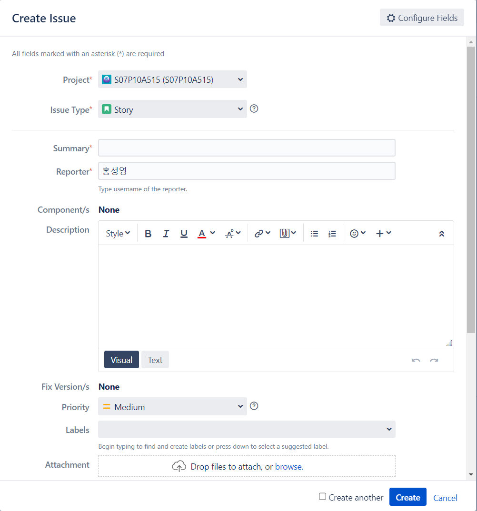
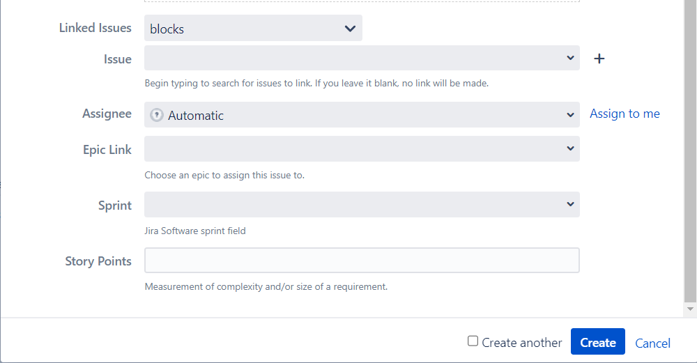

# JIRA

## 이슈 생성

Create 버튼을 눌러준다.

항목 설명
  

- Project: 해당 프로젝트

- Issue Type: 이슈의 분류

|  IssuType  |                                          설명                                          |                            예시                            |
| :--------: | :------------------------------------------------------------------------------------: | :--------------------------------------------------------: |
|   `Epic`   | 최상위 수준의 기능/작업 단위(프로젝트 전반 또는 여러 Sprint에 걸쳐 진행할 정도의 범위) |                   회원관리, 로그인 관리                    |
|  `Story`   |                      Epic에 대한 하위 Level 수준의 기능/작업 단위                      | 회원 가입, 회정 정보수정, 회원 탈퇴, 로그인, 비밀번호 찾기 |
|   `Bug`    |                           프로젝트 개발/검증 중 발견되 버그                            |           상품 검색시 특정 상품이 조회되지 않음            |
|   `Task`   |              개발에 직접 해당되지는 않으니 Sprint 안에 포함하여 해야할 일              |                ERD 작성, 테스트케이스 작성                 |
| `Sub-Task` |                위 Issue들과 관련하여 세부 단위 작업 등이 필요할때 등록                 |                                                            |
