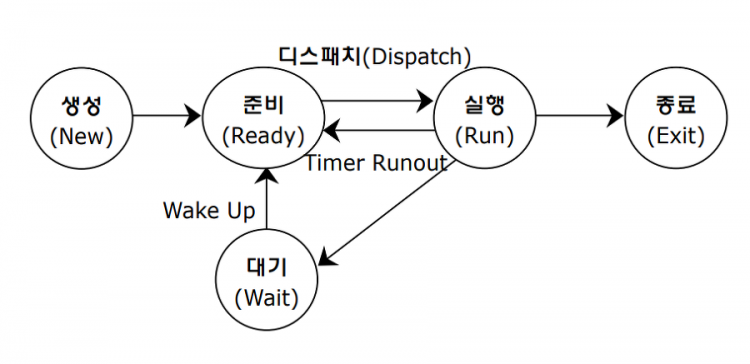
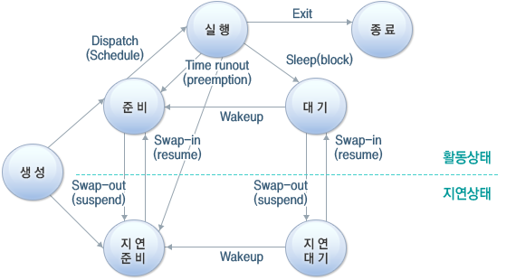

# 프로세스

- 프로세스(process): 메모리에 적재되어 실행중인 프로그램
- 윈도우 작업관리자, 리눅스 `ps -ef`로 프로세스 확인가능
- 포그라운드 프로세스(foreground process): 사용자가 보는 앞에서 실행되는 프로세스
- 백그라운드 프로세스(background process): 사용자가 보지 못하는 뒤에서 실행되는 프로세스
  - 데몬(daemon): 유닉스에서 사용자와 상호작용하지 않고, 돌아가는 백그라운드 프로세스
    - 데몬은 대개 부모 프로세스를 갖지 않으며, 즉 PPID가 1이며, 따라서 프로세스 트리에서 init 바로 아래에 위치한다.
  - 서비스(service): 윈도우는 서비스라고 함

## 프로세스가 CPU를 사용하는 방법

- 프로세스는 돌아가면서 CPU를 한정된 시간만큼 사용
- 자신의 차례가 되면 정해진 시간만큼 CPU를 사용하고
- 시간이 끝났음을 알리는 인터럽트(**타이머 인터럽트**)가 발생하면 다음 차례로 넘김
  - 타이머 인터럽트는 클럭 신호를 발생시키는 장치가 주기적으로 발생시키는 **하드웨어 인터럽트**
  - **타임아웃 인터럽트**라고도 함

# 프로세스 제어 블록(PCB, Process Control Block)

- 운영체제는 빠르게 번갈아 수행되는 프로세스의 실행 순서를 관리하고, CPU와 자원을 배분
- 이를 위해 **PCB**를 사용한다
- PCB는 프로세스와 관련된 정보를 저장하는 자료구조, 프로세스를 식별하기 위한 자료들이 저장
- PCB는 커널 영역에서 생성되고, 해당 프로세스가 종료되면 폐기
- 프로세스가 생성되었다는 뜻은 운영체제가 PCB를 생성했다는 뜻
- 프로세스가 종료되었다는 뜻은 운영체제가 PCB를 폐기했다는 뜻
- PCB가 프로세스의 중요한 정보를 포함하고 있기 때문에, 일반 사용자가 접근하지 못하도록 보호된 메모리 영역 안에 남는다. 일부 운영 체제에서 PCB는 커널 스택의 처음에 위치한다. (이 메모리 영역은 편리하면서도 보호를 받는 위치이기 때문이다.)
- PCB에 저장된 정보
  - 프로세스 ID
  - 레지스터 값
  - 프로세스 상태
  - CPU 스케줄링 정보
  - 메모리 관리 정보
  - 사용한 파일과 입출력장치 목록
  - 등등

## 프로세스 ID(Process ID, PID)

- 특정 프로세스를 식별하기 위해 부여한 고유한 번호

## 레지스터 값

- 프로세스는 자신의 실행 차례가 돌아오면 이전까지 사용했던 레지스터 값들을 모두 복원해야함
- 그래야 중단된 작업을 이어서 할수있음
- PCB에는 PC등 레지스터값이 저장됨

## 프로세스 상태

- 현재 프로세스가 어떤 상태인지
- 입출력장치 대기
- CPU를 사용하기 위해 대기
- CPU를 사용하고 있던 상태
- 등등 뒤에 서술

## CPU 스케줄링 정보

- 프로세스가 언제, 어떤 순서로 CPU에 할당할지

## 메모리 관리 정보

- 프로세스마다 메모리에 저장되는 위치가 다름
- PCB에 프로세스가 어느 주소에 저장되어 있는지에 대한 정보가 저장되어야함
- 즉 PCB에 베이스 레지스터, 한계 레지스터 값과 같은 정보들도 담김
- 또한 프로세스 주소를 알기 위한 페이지 테이블 정보다 있어야함 => 뒤에서 설명

## 사용한 파일과 입출력장치 목록

- 실행과정에서 특정 입출력장치나 파일을 사용하면 PCB에 내용 명시

# 문맥교환(Context Switching)

- 문맥(context) : 하나의 프로세스 수행을 재개하기 위해 기억해야할 정보
- 문맥교환 : 하나의 프로세스에서 다른 프로세스로 넘어 갈때, 기존 프로세스의 문맥을 PCB에 백업하고, 새로운 프로세스를 실행하기 위해 문맥을 PCB로 부터 복구하여 새로운 프로세스를 실행하는것
- 문맥 교환은 여러 프로세스가 끊임없이 빠르게 번갈아 가며 실행되게 해줌
- 문맥 교환이 자주 빠르게 번갈아 일어나면서, 우리 눈에는 프로세스들이 **동시**에 실행되는 것처럼 보임(실제로는 한개씩 실행이지만, 매우 빨라 우리는 인식 못함)
- 문맥 교환을 자주 하면 오버헤드가 발생하기 때문에, 문맥교환이 많은건 좋은건 아님

# 프로세스의 메모리 영역

- 메모리에 적재된 프로그램인 프로세스는 크게 4영역으로 나눠진다
- 코드 영역 (code segment)
- 데이터 영역 (data segment)
- 힙 영역 (heap segment)
- 스택 영역 (stack segment)

## 코드 영역

- 텍스트 영역(text segment)라고도 함
- 단어 그대로 실행할수 있는 코드 = 기계어로 이루어진 명령어들이 저장됨
- 코드 영역은 데이터가 아닌 CPU가 실행할 명령어가 담겨있기 떄문에 쓰기가 금지됨
- 즉 read- only 공간이다
- 크기가 고정된 정적 할당 영역

## 데이터 영역

- 데이터 영역은 잠깐 썼다가 없앨 데이터가 아닌 프로그램이 실행되는 동안 유지할 데이터가 저장되는 곳
- 주로 전역변수(global varialbe), static 변수가 대표적
- 크기가 고정된 정적 할당 영역

## 힙 영역

- 프로그래머가 직접 할당할 수 있는 저장 공간
- 프로그래밍 과정에 힙 영역에서 메모리 공간을 할당했다면 언젠가는 해당 공간을 반환해야함
- 반환하지 않는다면 할당한 공간은 메모리에 계속 자리를 차지하는 **메모리 누수**(memory leak)이 일어남
- 힙의 이름이 힙인 이유
- 자료구조의 힙과 다르다
- 크기가 변하는 동적 할당 영역
- 일반적으로 메모리의 낮은 주소에서 높은주소로 쌓아가며 할당

## 스택 영역

- 데이터를 일시적으로 저장하는 공간, 잠깐 쓰다가 말 값들을 저장
- 함수 실행이 끝나면 사라지는 매개 변수, 지역 변수가 대표적
- 크기가 변하는 동적 할당 영역
- 일반적으로 높은 주소에서 낮은 주소로 내려가며 스택을 쌓음

# 프로세스 상태

- 윈도우의 작업관리자에서 확인 가능(실행중, 일시 중단됨 등등)
- 프로세스는 저마다의 상태가 있음
- 운영체제는 이런 프로세스의 상태를 PCB에 기록하여 관리한다
- 그리고 많은 운영체제는 이처럼 동시에 실행되는 수많은 프로세스를 계층적으로 관리
- 프로세스 상태
  - 생성 상태
  - 준비 상태
  - 실행 상태
  - 대기 상태
  - 종료 상태
  - 등등 운영체제마다 표현방식이 조금씩 다름

## 생성 상태(new)

- 막 메모리에 적재되어 PCB를 할당받은 상태
- 생성 상태를 거쳐 실행할 준비가 완료된 프로세스는 바로 실행되지 않고 **준비상태**로 넘어가 대기

## 준비 상태(ready)

- 당장이라도 CPU를 할당 받아 실행할수 있지만, 차례가 아니기 때문에 대기중인 상태
- 자기 차례가 오면 CPU를 할당 받아 **실행상태**로 넘어감
- 준비상태에서 실행 상태로 전환되는 것을 **디스패치**(dispatch)라고 한다

## 실행 상태(running)

- CPU를 할당받아 실행 중인 상태
- 실행 상태인 프로세스는 할당된 일정 시간 동안만 CPU를 사용 가능
- 프로세스가 할당된 시간을 전부 사용하면, **타이머 인터럽트**가 발생해 **준비 상태**가 된다.
- 또는 입출력장치를 사용해 입출력장치의 작업이 끝날 때까지 기다려야 한다면 **대기 상태**가 된다

## 대기 상태(blocked, wait)

- 프로세스 실행 도중 입출력장치를 사용할때, 입출력이 끝날때까지(입출력 완료 인터럽트를 받을때까지) 기다리는 상태
- 입출력 작업이 완료되면 프로세스는 대기상태에서 다시 준비 상태로 넘어간 CPU 할당을 기다림
- 입출력만 있는건 아닌(대부분이긴 하지만), 특정 이벤트가 일어나길 기다릴때 프로세스는 대기상태가 됨

## 종료 상태(terminated)

- 프로세스가 종료된 상태
- 프로세스가 종료되면 운영체제는 PCB와 프로세스가 사용한 메모리 정리

## 프로세스 상태 다이어그램(process state diagram)

# 프로세스 계층 구조

- 프로세스 실행 도중 시스템 콜을 통해 다른 프로세스 생성 가능
- 부모 프로세스 (parent process) : 세 프로세스를 생성한 프로세스
- 자식 프로세스 (child process) : 부모 프로세스에 의해 생성된 프로세스
- 둘의 PID는 다르다(다른 프로세스 이므로)
- 일부 운영체제는 자식 프로세스의 PCB에 부모 프로세스의 PID인 **PPID**(parent PID)를 저장함
- 많은 운영체제에서 프로세스가 프로세스를 낳는 계층적 구조로 프로세스를 관리(트리 구조)
- 예시
  1. 컴퓨터를 켠 순간 최초 프로세스 생성
  2. 로그인을 담당하는 자식 프로세스 생성, (그외 데몬이나 서비스도 당연히 같이 생성)
  3. 로그인 프로세스는 사용자 인터페이스(bash) 프로세스를 생성
  4. 사용자 인터페이스 프로세스는 VIM 프로세스 생성
- 모든 프로세스 최상단의 최초의 프로세스
  - 유닉스 init
  - 리눅스 systemd
  - macOS launchd
  - 최초의 프로세스의 PID는 1이다
  - pstree 명령어로 프로세스 계층을 볼 수 있음

## 프로세스 생성 기법

- 윈도우를 제외한 대부분의 운영체제에서 사용되는 기법
- 부모 프로세스를 통해 생성된 자식 프로세스들은 **복제와 교체**를 통해 실행
- 부모 프로세스는 **fork**를 통해 자신의 복사본을 자식 프로세스로 생성하고
- 만들어진 복사본은 **exec**를 통해 자신의 메모리 공간을 다른 프로그램으로 교체
- fork와 exec는 시스템 콜이다
- fork로 생성된 프로세스는 부모 프로세스의 자원, 메모리 내의 내용, 열린 파일 목록등이 똑같다(PID나 저장된 메모리 위치는 당연히 다름)
- exec를 통해 코드영역, 데이터 영역은 실행할 프로그램의 내용으로 바뀌고, 나머지 영역은 초기화
- fork후 exec를 하지 않는 경우도 있음, 같은 코드를 병행하는 경우 or 프로세스끼리 자원을 공유하는 경우 (이를 copy on wirte 기법이라 함)
- 굳이 fork - exec 를 하는 이유는 UNIX의 개발 철학이다

## 실습
