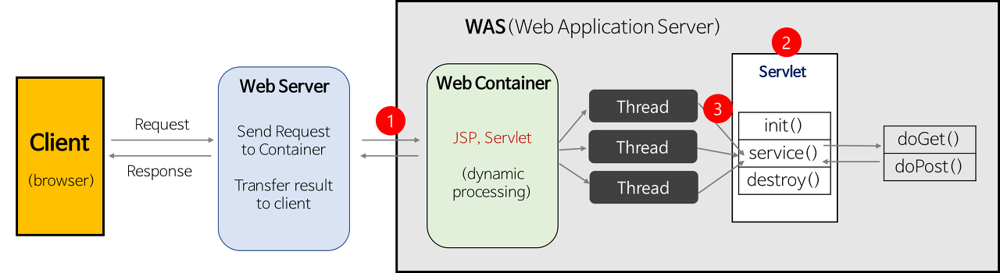

## Servlet의 작동원리



- 시나리오

1. 클라이언트가 주소를 치고 요청 보낸걸 doGet, doPost로 받음
2. 비지니스 로직등 다양한 로직 실행
3. 응답? => 기본적으로 html로 쏴준다.(웹브라우저가 인식해야지) (ajax면 Json이나 xml 형태로 쏴줘야한다.)

- 실제 순서

1. Web Server는 HTTP request를 Web Container(Servlet Container)에게 위임한다.

   - 1. web.xml 설정에서 어떤 URL과 매핑되어 있는지 확인

   - 2. 클라이언트(browser)의 요청 URL을 보고 적절한 Servlet을 실행

2. Web Container는 service() 메서드를 호출하기 전에 Servlet 객체를 메모리에 올린다.

   - 1. Web Container는 적절한 Servlet 파일을 컴파일(.class 파일 생성)한다.

   - 2. .class 파일을 메모리에 올려 Servlet 객체를 만든다.

   - 3. 메모리에 로드될 때 Servlet 객체를 초기화하는 init() 메서드가 실행된다.

3. Web Container는 Request가 올 때 마다 thread를 생성하여 처리한다.

   - 각 thread는 Servlet의 단일 객체에 대한 service() 메서드를 실행한다.

## 실제로 HTML로 보내주기

```java

import java.io.IOException;
import java.io.PrintWriter;

import javax.servlet.ServletException;
import javax.servlet.annotation.WebServlet;
import javax.servlet.http.HttpServlet;
import javax.servlet.http.HttpServletRequest;
import javax.servlet.http.HttpServletResponse;

@WebServlet("/hs") // 어노테이션 주소와 연결해준다.
public class HelloServlet extends HttpServlet {

  protected void doGet(HttpServletRequest request, HttpServletResponse response) throws   ServletException, IOException {
		String name ="홍성영";

		response.setContentType("text/html;charset=utf-8"); // 보내주는 문자열의 인코딩을 설정해줘야한다. 설정은 Writer보다 앞에 있어야함
		PrintWriter out = response.getWriter();
		out.println("");
		out.println("<html>");
		out.println("	<body>");
		out.println("		Hello! World!<br>");
		out.println("		안녕하세요 "+name+"!");
		out.println("	</body>");
		out.println("</html>");
	}
}
```

## doGet의 인자값 2가지 인자

1. request(클라이언트가 보낸 요청, 이 안에 요청에 관한 데이터가 들어있다.)
2. response(응답에 관련된것)

위에서는 `HttpServletRequest` request, `HttpServletResponse` response 이다.

## HttpServletRequest request 객체

- 사용자가 HTML Form에 입력한 내용(username과 password)을 request 객체에서 받아온다.
  즉, HTTP 프로토콜의 Request 정보를 Servlet에게 전달
- 헤더 정보, 파라미터, 쿠키, URI, URL, Body의 Stream 등을 읽어 들이는 메서드가 있다.
- getHeader(“원하는 헤더 이름”) : 이 메서드를 통해 원하는 헤더 정보를 확인할 수 있다.
- getParameter() : 이 메서드를 호출하여 form parameter 값을 가져온다.
  이런 parameter 값은 URL 또는 form의 input tag를 통해서 넘어올 수 있다.
- getParameterValues()
  form parameter가 두 번 이상 나타나고 여러 개의 값을 반환할 때 이 메서드를 호출한다. (Ex. checkbox)

## HttpServletResponse response 객체

- 인자의 내용에 맞게 동적인 HTML 코드를 생성하여 response 객체에 담아 반환한다.
- getWriter() 메서드를 호출하여 PrintWriter 객체을 가져온 후 해당 객체에서 print, println 메서드를 실행한다.
- 즉, form data를 처리한 결과를 Web Page에 생성(view 생성)하여 반환한다.
