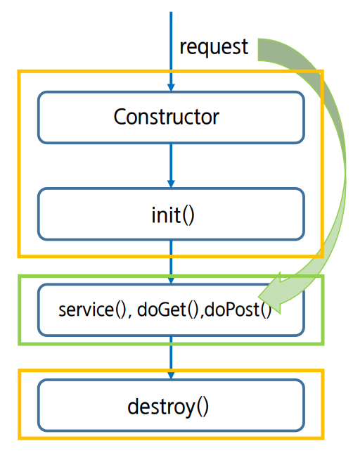

# Servlet의 라이프 사이클

- Servlet class는 main method가 없다! 이때까지 자바와 다르다... => 내가 직접 프로그램을 돌리는게 아니기 때문
- 즉 객체의 생성부터 사용(method call)의 주체가 사용자가 아닌 Servlet Container에게 있다.
- 즉 우리가 만든 Servlet 클래스의 함수를 오버라이드 해두면, 그것을 WAS에서 알아서 호출해서 사용한다. (우리는 어떤 요청이 들어오면 어떻게 행동할지만 미리 짜두는것)

## Servlet Container란?

- Servlet을 보관하고, 관리해주는 역할
- Servlet Engine이라고도 한다. WAS에 일부이며 Tomcat 또한 WAS의 일종이다.
-

## 과정

1. WAS는 클라이언트로부터 서블릿 요청을 받으면 해당 서블릿이 메모리에 있는지 확인
2. 없다면, 해당 클래스를 메모리에 로드 후 init(), service() 실행
3. 있다면, service() 실행
4. WAS가 종료되거나 웹 어플리케이션 갱신되어 서블릿 종료 요청시 destroy() 실행

## 생성

- Client가 요청을 하게 되면 Servlet Container는 Servlet 객체를 생성(**한번만**) 하고, 초기화(**한번만**) 하면 요청에 대한 처리(요청시 마다 반복)을 하게 된다. 또한 Servlet 객체가 필요 없게 되면 제거하는 일까지 Container가 담당하게 된다.
- 객체는 **하나**만 생성! 그럼 여러곳에서 같은 일을 동시 요청하면? Thread! Thread Pool을 이용해 WAS에서 알아서 관리해줌.(Client마다 Thread 할당)

## Servlet 라이프 사이클의 주요 method



- init(): 서블릿이 메모리에 로드 될때 한번 호출(코드 수정시 로드하면서 재호출)
- doGet(): GET방식으로 data 호출시
- doPost(): POST방식으로
- service(): 모든 요청은 service()를 통해서 doXXX()메소드로 이동, 인자로 ServletRequest, ServletResponse를 받는다.
- destroy(): 서블릿이 메모리에서 해제되면 호출 (코드 수정시 호출)

do나 service 메소드 외에는 한번씩만 호출된다.

## 실제 코드

```java
@WebServlet("/lifecycle")
public class LifeCycle extends HttpServlet {
	private static final long serialVersionUID = 1L;

	@Override
	public void init() throws ServletException {
		System.out.println("init() method call!");
	}

	protected void doGet(HttpServletRequest request, HttpServletResponse response) throws ServletException, IOException {
		System.out.println("doGet method call!");
	}

	@Override
	public void destroy() {
		System.out.println("destroy() method call!");
	}

}
``
```

## init()

- 한 번만 수행됨

- 클라이언트(browser)의 요청에 따라 적절한 Servlet이 생성되고 이 Servlet이 메모리에 로드될 때 init() 메서드가 호출

- 역할 : Servlet 객체를 초기화

## Service(request, response)

- 응답에 대한 모든 내용은 service() 메서드에 구현해야 함

- Servlet이 수신한 모든 request에 대해 service() 메서드가 호출됨

- HttpServlet을 상속받은 Servlet 클래스 (이하 하위 클래스) 에서 service() 메서드를 오버라이드 하지 않았다면,
  그 부모인 HttpServlet의 service()가 호출됨

- service() 메서드는 request의 type(HTTP Method : GET, POST, PUT, DELETE 등)에 따라 적절한 메서드

  (doGet, doPost, doPut, doDelete 등)를 호출함

- 즉, 하위 클래스에서 doGet, doPost 등의 메서드를 오버라이드 해두면 HttpServlet의 service() 메서드가 요청에

  맞는 메서드(하위 클래스에서 오버라이드한 메서드)를 알아서 호출할 수 있게 되는 것

- 메서드가 return 하면 해당 thread는 제거됨

요청/응답(request/response)를 처리하는 메서드다. 웹 서버는 서블릿에 대한 요청을 수신하면, service() 메서드를 호출하는 새로운 스레드를 생성한다.

서블릿이 Genericservlet이면 요청은 service() 메서드 자체에 의해 제공되고,

서블릿이 HttpServlet이면 service() 메서드는 요청을 수신하고 요청 유형(GET, POST, PATCH 등)에 따른 핸들러 메서드에 전달한다.

예를 들어 Get 요청인 경우 service() 메서드는 요청 매개변수와 함께 doGet() 메서드를 호출하여 요청을 doGet() 메서드로 전달한다.

service() 메서드는 서블릿 수명 주기 동안 여러 번 호출할 수 있다. 서블릿이 파괴되지 않는 한 각 클라이언트 요청에 대해 service() 메서드가 호출된다.
