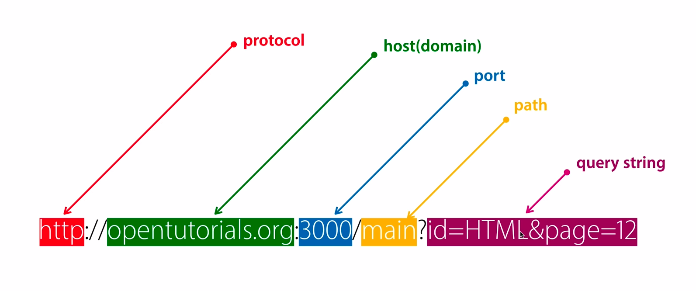
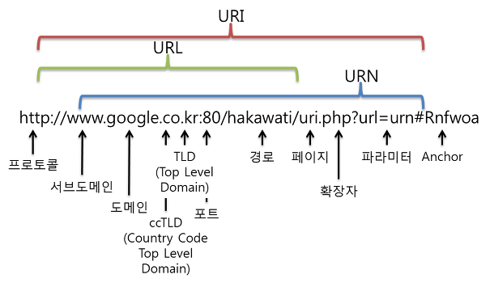

# Servlet의 Parameter 처리

## parameter 전송 방식?

이들은 HTTP 메소드이다. type이 아님(type은 ajax호출시 type 설정으로 GET, POST하는것)  
HTTP 메소드는 7~8개가 있지만 대표적으로 두가지만 소개

1. GET
   - 특징: 전송되는 데이터가 URL뒤에 Querty String으로 전달. 입력 값이 적은 경우나 데이터가 노출되어도 문제가 없을때 사용
   - 장점: 간단한 데이터를 빠르게 전송. form tag뿐만이 아니라 직접 URL에 입력하여 전송 가능.
   - 데이터 양에 제한이 있다.(location bar(URL + parameters))를 통해 전송할 수 있는 데이터의 사이즈는 2kb(2048byte)로 제한된다.
   - 캐싱이 가능해서 더 빠르다
   - 주소 뒤에 이름과 값이 결합된 스트링 형태로 전달
   - URL 뒤에 ?를 사용하여 Parameter를 자겅하고, &를 붙여 여러개의 Parameter 구분
2. POST
   - 특징: URL과 별도로 전송. HTTP header 뒤 body에 입력 스트림 데이터로 전달.
   - 장점: 데이터의 제한이 없다. 최소한의 보안 효과가 있다.(어차피 툴 쓰면 다 보임)
   - 단점: 전달 데이터의 야잉 같을 경우 GET보다 느리다.(전송 패킷을 body에 데이터를 구성해야한다. )
   - 캐싱이 불가능
   - Header Content-Type에 Body영역 데이터 타입을 명시해줘야한다. (ex Content-Type:application/json; charset=UTF-8)

## 웹사이트에서 페이지 이동시 어떤 메소드가 호출되는가?

1. 링크타고 이동
2. 주소 직접 입력
3. Form - Get, Post

이중에 Form-POST만 POST 방법이고 나머지는 다 GET방식이랑 똑같은 방법이다.

## URL




- URI (Uniform Resource Identifier) : 자원 식별자

  - 인터넷에 있는 자원을 나타내는 유일한 주소
  - URI의 존재는 인터넷에서 요구되는 기본조건으로서 인터넷 프로토콜에 항상 붙어 다닌다.

- URL (Uniform Resource Locator) : 자원의 위치

  - 네트워크상에 자원이 어디 있는지를 알려주기 위한 규약
  - 즉, 컴퓨터 네트워크와 검색 메커니즘에서의 위치를 지정하는, 웹 리소스에 대한 참조이다.
  - 흔히 웹 사이트 주소로 알고 있지만, URL은 웹 사이트 주소뿐만 아니라 컴퓨터 네트워크상의 자원을 모두 나타낼 수 있다. 그 주소에 접속하려면 해당 URL에 맞는 프로토콜을 알아야 하고, 그와 동일한 프로토콜로 접속해야 한다.

- URN (Uniform Resource Name) : 자원의 이름

## Query String

URL 뒤에 ?로 시작하여 [parameter name1]=[value1]&[parameter name2]=[value2]&...  
꼴로 붙어있는 문자열

## 실제 구현

Queryname은 html의 `input`, `select` 태그의 `name 속성`을 따라간다.

- 프론트엔드

```html
      <h5 class="text-center">Servlet을 이용한 파라미터 전달(Single)</h5>
      <form name="paramform" method="post" action="/bw/singleparam">
        <div class="form-group">
          <label for="userid">아이디:</label>
          <input
            type="text"
            class="form-control"
            placeholder="아이디 입력"
            name="userid"
          />
        </div>
        <div class="form-group">
          <label for="username">이름:</label>
          <input
            type="text"
            class="form-control"
            placeholder="이름 입력"
            name="username"
          />
        </div>
        <div class="form-group">
          <label for="area">지역:</label>
          <select name="area" class="custom-select">
            <option value="0">강남</option>
            <option value="1" selected>신천</option>
            <option value="2">잠실</option>
            <option value="3">서초</option>
            <option value="4">역삼</option>
          </select>
        </div>
        <button type="submit" class="btn btn-primary">전송</button>
      </form>
    </div>

```

- Servlet

```java
@WebServlet("/singleparam")
public class SingleParamServlet extends HttpServlet {
	private static final long serialVersionUID = 1L;

	protected void doGet(HttpServletRequest request, HttpServletResponse response) throws ServletException, IOException {
		System.out.println("doGet call!");

		String name = request.getParameter("username");
		String id = request.getParameter("userid");
		int area = Integer.parseInt(request.getParameter("area"));

		String color[] = {"blue", "orange", "pink", "green", "purple"};

		response.setContentType("text/html;charset=utf-8");
		PrintWriter out = response.getWriter();
		out.println("<html>");
		out.println("	<body>");
		out.println("	<h2 style=\"color:" + color[area] + "\">안녕하세요. " + name + "(" + id + ")님!</h2>");
		out.println("	</body>");
		out.println("</html>");
	}

	protected void doPost(HttpServletRequest request, HttpServletResponse response) throws ServletException, IOException {
		System.out.println("doPost call!!!!");

		request.setCharacterEncoding("utf-8");
		String name = request.getParameter("username");
		System.out.println(">>>>>>>>>>>>" + name);
		String id = request.getParameter("userid");
		int area = Integer.parseInt(request.getParameter("area"));


		String color[] = {"blue", "orange", "pink", "green", "purple"};

		response.setContentType("text/html;charset=utf-8");
		PrintWriter out = response.getWriter();
		out.println("<html>");
		out.println("	<body>");
		out.println("	<h2 style=\"color:" + color[area] + "\">안녕하세요. " + name + "(" + id + ")님!</h2>");
		out.println("	</body>");
		out.println("</html>");
	}

}
```

위에서 doPost와 doGet의 유일한 차이점은 `request.setCharacterEncoding("utf-8");`이다. 왜냐하면 Post는 http body에 데이터가 들어있는것을 어떻게 인코딩해야할지를 지정해줘야하기 때문이다. Get은 queryString에 있는대로 바로 받아서 사용할수 있다.

만약 Get에서도 한글이 깨지면 (Tomcat이나 WAS의 버전이 낮아서), 받아온 쿼리스트링을 바이트 단위로 쪼갠다음, 인코딩하면된다. `.getBytes("이전 인코딩","UTF-8")` 같은 방식

Post에서 매번 인코딩하는것이 귀찮거나 코드를 많이 차지 한다면, Filter를 설정할수 있다. Filter는 톰캣으로 넘어올때 기본적으로 설정을 하게 해준다.

## 여러개를 보낸다면? (같은 name으로)

checkbox같은 경우 같은 select에서 여러개의 value가 넘어온다.

```html
<form name="paramform" method="post" action="/bw/multiparam">
  <div class="form-group">
    <label for="">좋아하는 과일:</label>
  </div>
  <div class="form-group form-check">
    <div class="form-check-inline">
      <label class="form-check-label">
        <input
          type="checkbox"
          name="fruit"
          class="form-check-input"
          value="딸기"
        />딸기
      </label>
    </div>
    <div class="form-check-inline">
      <label class="form-check-label">
        <input
          type="checkbox"
          name="fruit"
          class="form-check-input"
          value="수박"
        />수박
      </label>
    </div>
    <div class="form-check-inline">
      <label class="form-check-label">
        <input
          type="checkbox"
          name="fruit"
          class="form-check-input"
          value="포도"
        />포도
      </label>
    </div>
    <div class="form-check-inline">
      <label class="form-check-label">
        <input
          type="checkbox"
          name="fruit"
          class="form-check-input"
          value="사과"
        />사과
      </label>
    </div>
  </div>
  <button type="submit" class="btn btn-primary">Submit</button>
</form>
```

```java
@WebServlet("/multiparam")
public class MultiParamServlet extends HttpServlet {
	private static final long serialVersionUID = 1L;

	protected void doGet(HttpServletRequest request, HttpServletResponse response) throws ServletException, IOException {
		fruitCall(request, response);
	}

	protected void doPost(HttpServletRequest request, HttpServletResponse response) throws ServletException, IOException {
		request.setCharacterEncoding("utf-8");// 인코딩 설정
		fruitCall(request, response);
	}

	protected void fruitCall(HttpServletRequest request, HttpServletResponse response) throws ServletException, IOException {
		// String name = request.getParameter("username");
		// String id = request.getParameter("userid");
		String[] fruit = request.getParameterValues("fruit");

		response.setContentType("text/html;charset=utf-8");
		PrintWriter out = response.getWriter();
		out.println("<html>");
		out.println("	<body>");
		out.print(name + "(" + id + ")님이 좋아하는 과일은 ");
		if(fruit != null) {
			int len = fruit.length;
			for(int i=0;i<len;i++) {
				out.print(fruit[i]);
				if(i != len - 1)
					out.print(", ");
			}
			out.println("입니다.");
		} else {
			out.println("없습니다.");
		}
		out.println("	</body>");
		out.println("</html>");
	}

}
```

`String[] fruit = request.getParameterValues("fruit");`  
이런 형식으로 Values를 배열로 받아서 계산할수 있다.

만약 그냥 `getParameter("fruit")'`하면 첫번째 인자만 받는다.
