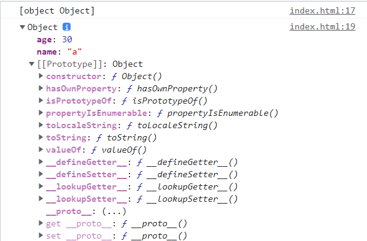

## 객체 생성 방법

자바스크립트는 클래스라는 개념이 없어서, JAVA처럼 클래스를 정의하고 인스턴스를 생성할수 없다.  
그래서 크게 3가지의 방식으로 생성이 가능하다.

1. `Object()` 생성자 함수 이용

```js
var foo = new Object();
//프로퍼티 생성
foo.name = "abc";
foo.age = 30;
foo.gender = "male";

console.log(typeof foo); //Object
console.log(foo); //
```

2. 객체 리터럴 방식( `{ }`)

- 그냥 `{}` 생성시 빈 객체가 된다.
- 프로퍼티의 값으로는 자바스크립트의 값을 나타내는 어떤 표현식도 올수있고, 만약 함수일 경우 프로퍼티를 메서드라고 부른다.

```js
var foo = {
  name: "abc", // 쉼표 필수!
  //"name" 같이 문자열도 가능
  age: 30,
  gender: "male",
  "first-name": "def"; // 프로퍼티에 특수문자나 띄어쓰기가 들어갔을때는 "문자열"로 해줘야함
};

console.log(typeof foo); //Object
console.log(foo); //
```

3. 생성자 함수 이용
   함수할때 추가 예정

## 객체 프로퍼티 읽기/갱신/생성

1. `[]` 대괄호 표기

   - **문자열이**나 **문자열의 값을 가진 변수**를 []사이에
   - js는 대괄호 표기법에 접근하려는 프로퍼티 이름을 문자열 형태로 만들지 않으면 모든 자바스크립트 객체에서 호출 가능한 toString() 메서드를 자동으로 호출해서 이를 문자열로 바꾸려는 시도를 한다.
   - 메서드 역시 이런 방법으로 접근이 가능하다.

2. `.` 마침표 표기

```js
var foo = {
  name: "abc",
  age: 30,
};
//읽기
console.log(foo.name); // abc
console.log(foo[name]); // undefined, name변수에 저장된게 없다
console.log(foo["name"]); // abc
console.log(foo["gender"]); // undefined

//갱신하기 (있는 프로퍼티에 값을 할당하면)
foo.age = 40;
foo["age"] = 45;

//동적 생성 (없는 프로퍼티에 값을 할당하면)
foo.gender = "male";
foo["major"] = "computer";
console.log(foo);

//대괄호만 써야하는 경우
foo["full-name"] = "abc def"; // 프로퍼티에 연산자나 띄어쓰기가 있는경우
//foo.full-name = "abc def"는 불가 => `-`가 빼기로 인식되어  undefined- name 이 되어 NaN(Not a Number 출력)
```

## 객체 출력

```js
var foo = {
  name: "abc",
  age: 30,
  gender: "male",
};

var prop;
for (prop in foo) {
  console.log(prop, foo[prop]);
}
```

### 프로퍼티 삭제

```js
var foo = {
  name: "abc",
  age: 30,
  gender: "male",
};

delete foo.gender;
console.log(foo);
delete foo; // 객체 삭제 안됨
console.log(foo); //delete는 객체 프로퍼티만 삭제 가능
```

## 참조 타입(객체) 특성

자바와 동일

```js
var objA = { val: 10 };
var objB = objA;

objB.val = 20;

console.log(objA.val); // 20
```

```js
var a = 100;
var objA = { val: 100 };

function changeArg(num, obj) {
  num = 200;
  obj.val = 200;
}

changeArg(a, objA);

console.log(a); //100
console.log(objA); //{val:200}
```

## 객체와 프로토타입

자바스크립의 모든 객체는 부모 역할을 하는 프로토 타입 객체와 연결되어있다. 상속처럼 부모 객체의 프로퍼티를 자신 것 처럼 쓸수 있다.

```js
var foo = {
  name: "a",
  age: 30,
};

console.log(foo.toString()); // 프로토타입의 toString 메소드 사용가능

console.dir(foo);
```



- 자바스크립의 모든 객체는 자신의 프로토타입을 가리키는 `[[Prototype]]`라는 숨겨진 프로퍼티를 가진다.
- 객체 리터럴로 생성한 경우 Object.prototype 객체가 프로토 타입이다.
- 크롬에서는 `__proto__` 형태로 구현되어있다.
- 객체를 생성할 때 결정된 프로토타입 객체는 임의의 다른 객체로 변경도 가능
- 프로토타입 체이닝에서 자세한 설명
